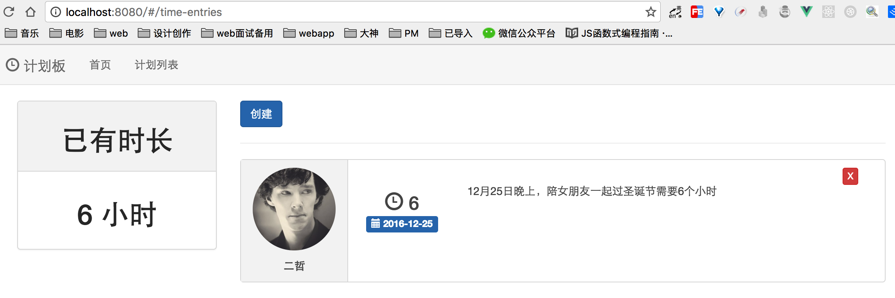

##Vue 2.0 构建单页应用最佳实战
  * vue及周边的库：
    * vue-cli -- 创建项目
    * vue-router -- 实现单页路由
    * vue-resource 请求node服务器
    * vuex -- 管理数据流
  * 原文地址：https://juejin.im/post/583d1fe00ce463006baca2fa

##目录结构
    |-- build                            // webpack配置文件 
    |-- config                           // 项目打包路径
    |-- src                              // 源码目录
    |   |-- assets                       // 图片
    |   |-- components                   // 组件
    |      |-- Home.vue                  // 主页
    |      |-- LogTime.vue           	   // 创建计划
    |      |-- sidebar.vue               // 左边栏
    |      |-- TimeEntries.vue           // 计划列表
    |		|-- store                   	   // 储存数据
    |      |-- actions.js                // 触发事件和配置参数
    |      |-- index.js                  // Vuex的逻辑
    |      |-- mutation-types.js         // 状态改变
    |      |-- mutations.js              // 状态改变的方法
    |   |-- App.vue                      // 页面入口文件
    |   |-- main.js                      // 程序入口文件，加载各种公共组件
    |-- .babelrc                         // ES6语法编译配置
    |-- .editorconfig                    // 代码编写规格
    |-- .gitignore                       // 忽略的文件
    |-- index.html                       // 入口html文件
    |-- package.json                     // 项目及工具的依赖配置文件
    |-- README.md                        // 说明
##demo展示

##技术点
  ####vue2.0
  ````
  // 实例化Vue
    var app = new Vue({
      el: '#app',
      router,
      store,    // 组件插入数据流的功能
      ...App    // 交给app组件渲染
    })
  ````
  ####vue-router
  SPA的核心，前端路由   
  第一步：引入并使用路由
  ````
  import VueRouter from 'vue-router'
  Vue.use(VueRouter)
  ````
  第二步：单页应用路由定义--一个路由，一个地址对应一个或者多个组件
  ````
  const routes = [{
    path: '/',        // 路由路径
    component: Home   // 模块路径
  }]
  ````
  第三步：实例化路由
  ````
  const router = new VueRouter({
    routes
  })
  ````
  ####注意：
  一、`vue-router`路由的参数由对象统一变为了数组要注意。还有则是实例化vue的`el`参数已经不能设置`html`和`body`了，因为在vue2中是会替换我们指定的标签  
  二、我们必须在实例化vue的时候指定渲染什么组件，以前我们是通过路由来指定如`router.start(App, '#app')`，而在vue2中则不需要了
  三、以前我们可以直接通过写a标签 然后写`v-link`属性进行路由跳转，在vue2中改为了写`<router-link>`标签再写对应属性`（to）`进行跳转
  ####axios
  vue不在更新，vue-resource；官方建议使用axios来处理ajax请求。  
  引入：
  ````
  import Axios from 'axios'
  ````
  ####vuex
  > 引入store，数据管理中心；  
  > store中   
  >> index.js 默认引入  
  >>>数据管理中心，Vuex的逻辑  
  >>>定义状态管理state  
  >>>实例化vuex
  ````
  export default new Vuex.Store({
    state,        // 状态: 管理状态
    mutations,    // 改变： 改变声明，直接改变state
    actions       // 动作，不能直接改变state，-->mutations
  })
  ````
  >>mutation-types 记录我们所有的事件名 
  >>>记录所有事件名
  >>>例如：
  ````
  export const ADD_TOTAL_TIME = 'ADD_TOTAL_TIME';
  ````
    
  >>mutations 注册我们各种数据变化的方法 
   >>>例如：
   ````
   [types.ADD_TOTAL_TIME] (state, time) {
       state.totalTime = state.totalTime - (-time)
     }
   ````
  >>actions 则可以编写异步的逻辑或者是一些逻辑，再去commit  
  >>>例如：  
  ````
  addTotalTime({ commit }, time) {
      commit(types.ADD_TOTAL_TIME, time)
    },
  ````
  ####components
  引入组件，构建页面   
  * App.vue主组件
  * 其他组件
  ```
    const routes = [{
      path: '/', component: Home
    },
      {
        path: '/home', component: Home
      },
      {
        path : '/time-entries', component : TimeEntries,
        // 子路由
        children : [{
          path : 'log-time',
          component : resolve => require(['./components/LogTime.vue'], resolve)
        }]
      }]
  ```
  
  
  
  
  
  
  
  
  
  
  
  
  
  
  
  
  
  
  
  
  
  
  
  
